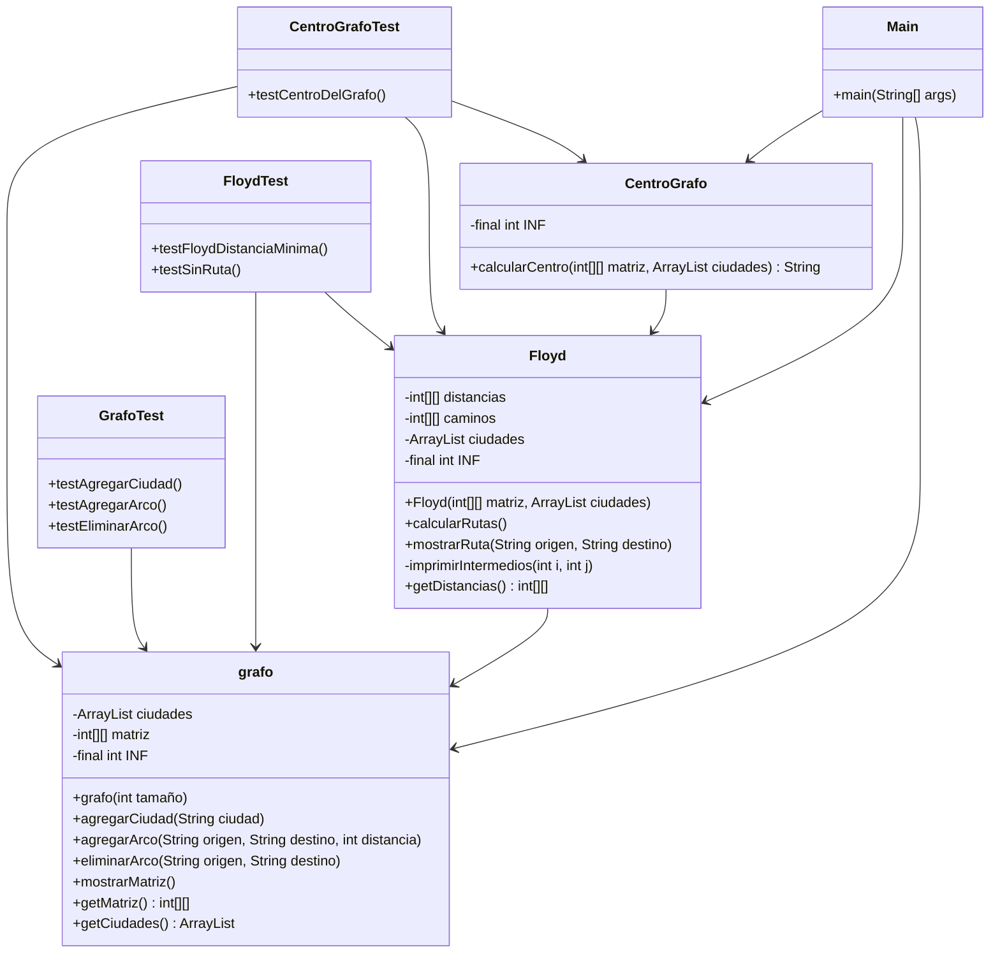

# Diagrama UML - Proyecto Floyd Warshall

```mermaid
classDiagram

class grafo {
    -ArrayList<String> ciudades
    -int[][] matriz
    -final int INF

    +grafo(int tamaño)
    +agregarCiudad(String ciudad)
    +agregarArco(String origen, String destino, int distancia)
    +eliminarArco(String origen, String destino)
    +mostrarMatriz()
    +getMatriz() int[][]
    +getCiudades() ArrayList<String>
}

class Floyd {
    -int[][] distancias
    -int[][] caminos
    -ArrayList<String> ciudades
    -final int INF

    +Floyd(int[][] matriz, ArrayList<String> ciudades)
    +calcularRutas()
    +mostrarRuta(String origen, String destino)
    -imprimirIntermedios(int i, int j)
    +getDistancias() int[][]
}

class CentroGrafo {
    -final int INF

    +calcularCentro(int[][] matriz, ArrayList<String> ciudades) String
}

class Main {
    +main(String[] args)
}

class GrafoTest {
    +testAgregarCiudad()
    +testAgregarArco()
    +testEliminarArco()
}

class FloydTest {
    +testFloydDistanciaMinima()
    +testSinRuta()
}

class CentroGrafoTest {
    +testCentroDelGrafo()
}

Main --> grafo
Main --> Floyd
Main --> CentroGrafo

Floyd --> grafo
CentroGrafo --> Floyd

GrafoTest --> grafo
FloydTest --> Floyd
FloydTest --> grafo
CentroGrafoTest --> CentroGrafo
CentroGrafoTest --> Floyd
CentroGrafoTest --> grafo
```
